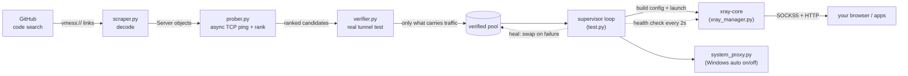
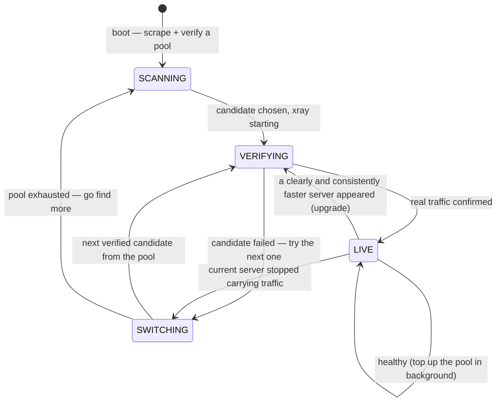

<p align="center">
  <a href="README.md"></a>
  <a href="README.fa.md"></a>
</p>

<p align="center">
  
</p>

<h1 align="center">WRAITH</h1>

<p align="center">
  <b>یه فیلترشکن مبتنی بر V2Ray که خودش خودشو مدیریت می‌کنه.</b><br/>
  کانفیگ‌های عمومی vmess رو از گیت‌هاب جمع می‌کنه، واقعاً تست می‌کنه کدوم‌ها
  کار می‌کنن (نه فقط کدوم‌ها پینگ می‌خورن)، و روی سریع‌ترینش می‌مونه —
  خودکار، تا وقتی خودت ببندیش.
</p>

<p align="center">
  
  
  
  
</p>

<p align="center">
  ساخته شده توسط <a href="https://github.com/Amirzamani1l"><b>Amirzamani1l</b></a>
</p>

---

## فهرست مطالب

- [چرا این پروژه رو ساختم](#چرا-این-پروژه-رو-ساختم)
- [یه نگاه کلی](#یه-نگاه-کلی)
- [واقعاً چیکار می‌کنه](#واقعاً-چیکار-می‌کنه)
- [معماری](#معماری)
- [چرخه‌ی خودترمیمی](#چرخه‌ی-خودترمیمی)
- [داشبورد زنده](#داشبورد-زنده)
- [دریافتش کن](#دریافتش-کن)
- [پورت‌ها](#پورت‌ها)
- [تنظیمات و تیونینگ](#تنظیمات-و-تیونینگ)
- [ساختار پروژه](#ساختار-پروژه)
- [زیر کاپوت](#زیر-کاپوت)
- [بخش صادقانه (این رو بخون)](#بخش-صادقانه-این-رو-بخون)
- [حمایت از این پروژه](#حمایت-از-این-پروژه)
- [رفع اشکال](#رفع-اشکال)
- [ساخت exe ویندوز به‌دست خودت](#ساخت-exe-ویندوز-به‌دست-خودت)
- [مشارکت](#مشارکت)

---

## چرا این پروژه رو ساختم

عمداً رایگان و متن‌بازه. وقتی دسترسی به اینترنت محدود میشه، بعضیا سرورهای
فیلترشکنی که کار می‌کنن رو چند برابر قیمت می‌فروشن به کسایی که بیشترین
نیاز رو دارن. کل هدف این پروژه اینه که این کار رو بی‌معنی کنه — هرکسی
می‌تونه اجراش کنه، هرکسی می‌تونه کدش رو بخونه، هرکسی می‌تونه فورکش کنه.

بدون اکانت. بدون اشتراک. بدون واسطه. فقط یه برنامه که سرورهای سالم رو
پیدا می‌کنه، واقعاً تست می‌کنه کار می‌کنن یا نه، و تو رو به بهترینی که
پیدا کرده وصل نگه می‌داره.

---

## یه نگاه کلی

| | |
|---|---|
| **چیه** | یه اپ ترمینالی که یه تونل پروکسی سالم رو بدون هیچ مراقبتی زنده نگه می‌داره |
| **چطور سرور پیدا می‌کنه** | تو کدهای عمومی گیت‌هاب دنبال لینک‌های `vmess://` می‌گرده و دیکودشون می‌کنه |
| **چطور انتخاب می‌کنه** | تست واقعی end-to-end تونل — نه یه پینگ TCP — رتبه‌بندی بر اساس تأخیر واقعی |
| **وقتی یکی از کار میفته** | فوراً به سرور تأییدشده‌ی بعدی سوییچ می‌کنه، pool رو هم در پس‌زمینه پر می‌کنه |
| **روی ویندوز** | پروکسی سیستم رو خودکار روشن/خاموش می‌کنه — اکثر برنامه‌ها (از جمله Chrome) خودشون کار می‌کنن |
| **روی لینوکس/مک** | باید خودت برنامه‌ت رو به پروکسی محلی وصل کنی، بقیه‌ش دقیقاً همونه |
| **وابستگی‌ها** | `requests`, `python-dotenv`, `rich` — به‌علاوه Xray-core که خودش دانلود می‌کنه |
| **رابط کاربری** | داشبورد ترمینال زنده و متحرک که حتی روی `cmd.exe` خام ویندوز هم درست نشون میده |

---

## واقعاً چیکار می‌کنه

۱. **جمع‌آوری** — تو کدهای عمومی گیت‌هاب دنبال لینک‌های `vmess://` می‌گرده و دیکودشون می‌کنه.
۲. **تأیید** — یه پینگ TCP فقط میگه پورت بازه، نه اینکه چیز مفیدی پشتش هست. هر
   کاندیدا یه تونل موقت خودش و یه درخواست واقعی از توش رد می‌شه — فقط
   سرورهایی که واقعاً ترافیک رد می‌کنن قبول میشن.
۳. **رتبه‌بندی** — بر اساس تأخیر واقعی رفت‌وبرگشت از پشت تونل تأییدشده، با
   یه امتیاز اضافه برای امنیت انتقال بیشتر (TLS/WS در برابر TCP خام).
۴. **اتصال** — Xray-core رو محلی به‌عنوان پروکسی SOCKS5 + HTTP اجرا می‌کنه، و
   (روی ویندوز) پروکسی سیستم رو خودکار روشن می‌کنه که برنامه‌ها نیاز به تنظیم دستی نداشته باشن.
۵. **ترمیم** — اگه سرور فعلی از کار بیفته یا افت کنه، فوراً به کاندیدای
   تأییدشده‌ی بعدی سوییچ می‌کنه، و در پس‌زمینه از گیت‌هاب سرورهای تازه
   می‌گیره که همیشه یه پشتیبان آماده باشه.
۶. **نمایش** — یه داشبورد ترمینال زنده: وضعیت اتصال، تاریخچه‌ی تأخیر،
   تعداد سرورهای تأییدشده، جدول سرورها، فید رویدادها.

بدون رابط گرافیکی. بدون وصل‌کردن دستی. بدون مراقبت مداوم.

---

## معماری

هر مرحله یه ماژول جداست با یه وظیفه‌ی مشخص. داده از چپ به راست جریان
داره؛ حلقه‌ی supervisor حلقه رو می‌بنده و وقتی یه لینک قطع بشه ترمیمش می‌کنه.



**ایده‌ی اصلی:** اکثر ابزارها همینجا متوقف میشن که "پورت به پینگ جواب داد."
WRAITH بهش اعتماد نمی‌کنه. یه پینگ ثابت می‌کنه پورت بازه؛ ثابت **نمی‌کنه**
که یه تونل vmess زنده با UUID معتبر پشتش هست. پس هر کاندیدا واقعاً *استفاده*
میشه قبل از اینکه بهش اعتماد بشه — یه نمونه‌ی موقت Xray برای هر سرور، یه
درخواست واقعی HTTP از توش رد میشه، و فقط اونایی که واقعاً بایت رد می‌کنن زنده می‌مونن.

---

## چرخه‌ی خودترمیمی

Supervisor مالک تمام تصمیمات اتصال/سوییچه، تا داشبورد بتونه با سرعت کامل
انیمیشن‌ها رو نشون بده. این‌ها دقیقاً حالت‌هایی هستن که badge بالای هدر
ازشون رد میشه:



چندتا تصمیم عمدی این‌جا هست:

- **بی‌میله یه لینک سالم رو ول کنه.** یه افت موقتی تأخیر اتصالت رو قطع نمی‌کنه.
  یه کاندیدا باید به‌طور واقعی (`SWITCH_MARGIN_MS`) و چندبار پشت‌سرهم
  (`SWITCH_CONFIRMATIONS`) سریع‌تر باشه، و سوییچ‌ها هم محدود به یه بازه‌ی
  زمانی هستن (`MIN_SWITCH_INTERVAL`) که هیچ‌وقت بین دو سرور رفت‌وبرگشت نکنه.
- **سرورهای پینگ‌خور ولی مرده کنار گذاشته میشن.** سروری که پینگ جواب داده
  ولی تست واقعی تونل رو رد کرده، یه مدت (`BENCH_SECONDS`) کنار گذاشته میشه
  به‌جای اینکه بارها دوباره انتخاب بشه. اگه کل بنچ پر بشه، پاک میشه و همه
  یه شانس دوباره می‌گیرن.
- **Pool همیشه گرم نگه داشته میشه.** وقتی خوشحال و وصلی، در پس‌زمینه بی‌صدا
  pool پشتیبان رو دوباره پر می‌کنه، پس قطعی *بعدی* فوراً ترمیم میشه به‌جای
  اینکه یه اسکن سرد کامل رو راه بندازه.

---

## داشبورد زنده

همه‌چیز با [`rich`](https://github.com/Textualize/rich) رندر میشه، و مجموعه‌ی
گلیف موقع import انتخاب میشه — کاراکترهای کامل بلوکی وقتی کنسول
پشتیبانی کنه، بازگشت خودکار به ASCII خالص وقتی نکنه (پس حتی روی `cmd.exe`
خام ویندوز هم درست نشون میده، نه فقط ترمینال‌های مدرن).

| پنل | چی نشون میده |
|---|---|
| **هدر / بنر** | لوگوی متحرک WRAITH، بج وضعیت زنده (LIVE / VERIFYING / SWITCHING / SCANNING / DOWN)، نود فعلی، uptime، و یه متر "درصد ترافیکی که رد میشه" |
| **TUNNEL** | نود فعال، چقدر پایدار بوده، وضعیت پروکسی سیستم، کیفیت اتصال، و آدرس‌های محلی SOCKS5/HTTP |
| **LATENCY** | یه sparkline از زمان‌های رفت‌وبرگشت اخیر با now/avg/best/drop (شکاف‌های تو خط یعنی چک‌های ازدست‌رفته) |
| **POOL** | چندتا سرور جمع‌آوری شده، چندتا تأیید شده، چندتا مرده، به‌علاوه پشتیبان‌های آماده‌ت |
| **LIVE SERVER GRID** | همه‌ی سرورهای جمع‌آوری‌شده رتبه‌بندی‌شده با پینگ، پروتکل، امتیاز امنیتی، و ریپوی منبع — سرور فعلی، پشتیبان‌های تأییدشده، و مرده‌های بنچ‌شده همه رنگ‌بندی شدن |
| **LIVE FEED** | یه لاگ رویداد با timestamp: اتصال‌ها، سوییچ‌ها، مرگ‌ها، اسکن‌ها، هشدارها |

---

## دریافتش کن

### ویندوز، بدون نیاز به پایتون

آخرین نسخه‌ی `WRAITH.exe` رو از [صفحه‌ی Releases](../../releases) بگیر و
اجراش کن. یه workflow گیت‌هاب اکشن خودکار از سورس، هر بار Release منتشر
میشه، می‌سازتش — پس هیچ‌وقت با کد این‌جا ناهماهنگ نمیشه.

### اجرا از سورس (هر سیستم‌عاملی)

```bash
pip install -r requirements.txt
cp .env.example .env        # ویندوز: copy .env.example .env
```

یه توکن گیت‌هاب تو `.env` بذار — **هیچ scope‌ای لازم نیست**، فقط برای
محدودیت سرچ بالاتره (۵۰۰۰ در ساعت در برابر ۶۰ در ساعت بدون توکن):

> `github.com/settings/tokens` → **Generate new token (classic)** → هیچ
> scope رو تیک نزن → **Generate**

> ⚠️ **هیچ‌وقت `.env` رو کامیت نکن.** از قبل تو `.gitignore` هست، ولی قبل
> از پوش کردن هرچیز عمومی دوباره چک کن. `.env.example` این ریپو عمداً
> یه توکن جعلی داره — محلی جایگزینش کن، نه تو فایل کامیت‌شده.

```bash
python test.py
```

اولین اجرا خودکار Xray-core رو دانلود می‌کنه (یه‌بار، چند مگابایت، تو
پوشه‌ی داده‌ی کاربرت کش میشه که بین اجراها بمونه و هر بار دوباره دانلود نشه).

هر وقت خواستی با `Ctrl+C` خارج شو — تنظیمات پروکسی اصلیت رو برمی‌گردونه و
Xray-core رو تمیز می‌بنده.

---

## پورت‌ها

وقتی اجرا شد، مرورگر یا برنامه‌ت رو به این آدرس‌ها وصل کن:

| پروتکل | آدرس |
|---|---|
| SOCKS5 | `127.0.0.1:10808` |
| HTTP | `127.0.0.1:10809` |

روی **ویندوز** این خودکار انجام میشه — اکثر برنامه‌ها از جمله Chrome بدون
هیچ تنظیم دستی، پروکسی سیستم رو خودشون می‌گیرن. روی **لینوکس/مک** باید
خودت این‌ها رو تو تنظیمات شبکه‌ی برنامه یا سیستم‌عامل بذاری.

---

## تنظیمات و تیونینگ

مقادیر پیش‌فرض معقولی تو [`test.py`](test.py) هست. به‌ندرت لازمه دستشون
بزنی، ولی اگه می‌خوای واکنش‌پذیری رو با پایداری معامله کنی (یا برعکس)،
این‌ها همون دسته‌های تنظیمن:

| ثابت | پیش‌فرض | چی رو کنترل می‌کنه |
|---|---:|---|
| `HEALTH_INTERVAL` | `2.0` ثانیه | فاصله بین چک‌های واقعی اتصال روی تونل زنده |
| `MAX_CONSECUTIVE_FAILS` | `2` | چک‌های ناموفق پشت‌سرهم قبل از رهاکردن یه سرور |
| `VERIFY_TIMEOUT` | `3.5` ثانیه | timeout هر درخواست برای یه چک سلامت |
| `VERIFY_ATTEMPTS` | `2` | تلاش‌ها قبل از رد کردن یه کاندیدا موقع اتصال |
| `SETTLE_SECONDS` | `1.2` ثانیه | مهلت برای bind و handshake کردن Xray بعد از استارت |
| `BENCH_SECONDS` | `300` ثانیه | چقدر یه سرور اثبات‌شده‌ی مرده بنچ می‌مونه |
| `VERIFY_BATCH` | `8` | تعداد سرورهایی که **همزمان** تأیید میشن (هرکدوم تو Xray جدا) |
| `POOL_SCAN_LIMIT` | `32` | چقدر عمیق تو لیست رتبه‌بندی‌شده حاضره بره |
| `POOL_TARGET` | `4` | وقتی این‌قدر سرور تأییدشده پیدا شد، اسکن متوقف میشه |
| `SWITCH_MARGIN_MS` | `120` میلی‌ثانیه | کاندیدا باید حداقل این‌قدر از سرور فعلی بهتر باشه… |
| `SWITCH_CONFIRMATIONS` | `5` | …این تعداد بار پشت‌سرهم، قبل از یه ارتقا |
| `MIN_SWITCH_INTERVAL` | `45` ثانیه | هیچ‌وقت بیشتر از این تناوب ارتقا نده (جلوی flapping) |

فریم‌ریت بدون دستکاری کد، با یه متغیر محیطی هم قابل محدودسازیه:

```bash
WRAITH_FPS=12 python test.py     # مصرف CPU کمتر روی ترمینال کند
WRAITH_INTRO=0 python test.py    # رد کردن انیمیشن باز شدن روح موقع استارت
```

---

## ساختار پروژه

```
test.py                  نقطه ورود، حلقه‌ی supervisor، چک‌های سلامت، اتصال داشبورد زنده
ui.py                    رندر ترمینال (rich) — بنر، پنل‌ها، sparkline، جدول سرورها
ghost.py                 باز شدن سرد استارتاپ: انیمیشن واقعی روح رو به‌شکل فیلم ASCII پخش می‌کنه
ghost_frames.py          فریم‌های انیمیشن روح (دیکود شده از GIF منبع، فشرده)
scraper.py               سرچ کد گیت‌هاب + دیکود vmess
prober.py                موتور async پینگ TCP، امتیازدهی/رتبه‌بندی
verifier.py              تأیید واقعی تونل end-to-end (نه فقط پینگ)
xray_manager.py          دانلود باینری + checksum، ساخت کانفیگ، مدیریت پروسه
system_proxy.py          روشن/خاموش خودکار پروکسی سیستم ویندوز
banner.svg               بنر README
requirements.txt         وابستگی‌های پایتون
.env.example             نمونه‌ی توکن — کپی کن به .env (git-ignored)
.gitignore               دور نگه‌داشتن سکرت‌ها، کش‌ها، و کانفیگ runtime از گیت
.github/workflows/       CI که هر Release یه exe مستقل ویندوز می‌سازه
LICENSE                  MIT
```

توضیح فایل‌به‌فایل مسئولیت هر ماژول:

### `test.py` — مغز متفکر

مغز اصلی. بنر + توالی استارتاپ رو بوت می‌کنه، توکنت رو می‌خونه، اسکرپ رو
راه می‌ندازه، بعد دو تسک async رو همیشه اجرا می‌کنه: **prober** (حلقه‌ی
پینگ پس‌زمینه) و **supervisor** (حلقه‌ی زنده‌نگه‌داشتن که مالک هر تصمیم
اتصال/سوییچ/ارتقاست). حلقه‌ی رندر تطبیقی داشبورد رو هم اجرا می‌کنه —
فریم‌ریت خودش رو بین `FPS_MIN` و `WRAITH_FPS` بر اساس اینکه هر فریم واقعاً
چقدر طول می‌کشه رسم بشه تنظیم می‌کنه، پس یه کنسول کند به «نرم ولی کندتر»
تنزل می‌کنه، نه پارگی تصویر. منطق واقعی چک سلامت، بنچ، و سازنده‌ی pool
هم اینجاست.

### `ui.py` — داشبورد

رندر خالص، بدون منطق. لوگوی حروف بلوکی برجسته (با بازگشت ASCII)، لوگوی
موج‌رنگی متحرک، نوار «sweep» پرشی، متر سیگنال چهاربار، sparkline تأخیر،
و هر پنج پنل زنده رو می‌کشه. مجموعه‌ی گلیفش رو موقع import انتخاب می‌کنه
و اگه کنسول نتونه کاراکترهای بلوکی رو انکود کنه به ASCII خالص میفته.
همه‌چیز این‌جا از یه `state` dict مشترک می‌خونه که supervisor توش
می‌نویسه — UI فقط می‌خونتش، همینه که جلوی دعوای دو حلقه سر ترمینال رو می‌گیره.

### `scraper.py` — پیدا کردن سرورها

چندتا کوئری سرچ کد گیت‌هاب رو اجرا می‌کنه، محتوای فایل‌ها رو می‌گیره،
لینک‌های `vmess://` رو با regex پیدا می‌کنه، و هرکدوم رو به یه `Server`
dataclass تایپ‌شده دیکود می‌کنه. درخواست‌های خودش رو زیر سقف rate-limit
سرچ گیت‌هاب کنترل می‌کنه که هیچ‌وقت مکانیزم تشخیص سوءاستفاده رو نزنه، و
تمیز فرق می‌ذاره بین یه توکن خراب/منقضی (`GitHubAuthError`) و یه
rate-limit عادی (که فقط صبر می‌کنه تمومش بشه). امتیاز `safety_score` هر
سرور رو هم حساب می‌کنه — یه هیوریستیک که لایه‌های بیشتر رمزنگاری/مبهم‌سازی رو پاداش میده.

### `prober.py` — موتور پینگ

همزمان به هر سرور یه اتصال TCP باز می‌کنه و رفت‌وبرگشت رو به میلی‌ثانیه
ثبت می‌کنه (یا مرده علامت می‌زنه). سرورهای در دسترس رو با یه امتیاز
ترکیبی رتبه‌بندی می‌کنه: پینگ کمتر بهتره، و هر واحد `safety_score` مثل
یه تخفیف ۳۰ میلی‌ثانیه‌ای حساب میشه — پس یه سرور کمی کندتر ولی با
TLS/WS می‌تونه از یه سرور TCP خام سریع‌تر جلو بزنه. `ranked_servers()` رو
هم expose می‌کنه که supervisor بتونه وقتی انتخاب اول خراب دراومد بره
سراغ کاندیدای بعدی.

### `verifier.py` — اثبات اینکه سرورها واقعاً کار می‌کنن

تست صادقانه. برای هر کاندیدا یه Xray موقت روی یه جفت پورت محلی جدا
راه می‌ندازه، یه درخواست واقعی موازی از هرکدوم رد می‌کنه، و فقط سرورهایی
که واقعاً ترافیک رد کردن رو برمی‌گردونه — رتبه‌بندی‌شده بر اساس تأخیر
*واقعی* end-to-end، نه پینگ خام. هر پروسه قبل از برگشتن تخریب میشه، پس
هیچی در پس‌زمینه نمی‌مونه. مجموعه‌ی URL های تست به یه allow-list سخت‌گیرانه
قفل شده: یه درخواست به هرچیز دیگه‌ای بلندبلند خطا میده به‌جای اینکه بی‌صدا
از پشت یه تونل ناشناس درز کنه.

### `xray_manager.py` — کنترل‌کننده‌ی core

نسخه‌ی درست Xray-core رو برای سیستم‌عامل/معماریت مستقیماً از Release های
رسمی گیت‌هاب XTLS دانلود می‌کنه **و checksum SHA256 رو در برابر فایل
`.dgst` منتشرشده تأیید می‌کنه** قبل از استخراج هرچیزی — یه باینری
جابه‌جاشده رد میشه، نه اجرا. کانفیگ JSON Xray رو از یه `Server` می‌سازه
(پشتیبانی از transport های ws/grpc/h2/tcp-http، به‌علاوه TLS با SNI،
ALPN و uTLS fingerprint)، جلوی اشغال بودن پورت رو می‌گیره، و چرخه‌ی
حیات پروسه‌ی Xray رو مدیریت می‌کنه. stderrش تو یه لاگ کوچیک برای دیباگ
نوشته میشه و موقع خروج تمیز پاک میشه (چون ممکنه IP و UUID سرورها توش
باشه — دلیلی نداره روی دیسک بمونه وقتی برنامه رو بستی).

### `system_proxy.py` — تنظیم خودکار ویندوز

پروکسی سیستم ویندوز رو با نوشتن تو رجیستری کاربر فعلی روشن/خاموش می‌کنه
(`HKCU`، پس نیازی به دسترسی ادمین نیست). **اول تنظیمات اصلیت رو ذخیره
می‌کنه** و دقیقاً موقع خروج برشون می‌گردونه، و به WinINet میگه تنظیمات
عوض شده که Chrome/Edge فوراً بگیرنش. ترافیک localhost و LAN از تونل
مستثنی میشه. روی لینوکس/مک این توابع بی‌ضرر هیچ‌کاری نمی‌کنن — اونجا
یه سوییچ واحد و جهانی برای پروکسی سیستم وجود نداره، پس اون کاربرها باید
خودشون برنامه‌شون رو به پروکسی محلی وصل کنن.

### `config_active.json` (تولیدشده، کامیت‌نشده)

کانفیگ زنده‌ی Xray برای سروری که الان بهش وصلی. موقع اجرا توسط
`xray_manager.py` نوشته میشه و **git-ignored** هست — چون یه artifact
تولیدشده‌ست و آدرس + UUID یه سرور خاص رو توش داره، عمداً بیرون از ریپو نگه داشته میشه.

---

## زیر کاپوت

چندتا تصمیم طراحی که ارزش گفتن دارن، چون فرق بین «گاهی وصل میشه» و
«همیشه وصل می‌مونه» همینا هستن:

- **پینگ یعنی اتصال نیست.** خیلی از کانفیگ‌های جمع‌آوری‌شده به سرورهای
  وب معمولی اشاره می‌کنن یا UUID منقضی دارن. پینگ TCP رو فوراً جواب
  می‌دن، امتیاز خوبی می‌گیرن، اول انتخاب میشن، و هیچ‌وقت حتی یه بایت رد
  نمی‌کنن. تأیید کل دلیلیه که این ابزار قابل‌اعتماده — نگاه کن به
  [`verifier.py`](verifier.py).
- **تأیید موازی.** تست کردن کاندیداها یکی‌یکی خیلی کنده — یه سرور مرده
  چندتا ثانیه timeout هزینه داره، و ممکنه ده‌ها تا باشن. پس یه batch کامل
  همزمان تست میشه، هرکدوم تو یه Xray مجزا با پورت‌های خودش.
- **رتبه‌بندی امنیت‌محور.** تأخیر تنها چیزی نیست که مهمه. امتیازدهی به
  transport های TLS/WS/gRPC نسبت به TCP خام یه شروع بهتر میده، پس یه
  سرور کمی کندتر ولی بهتر مبهم‌شده می‌تونه ببره. این یه هیوریستیک
  *اولویت‌بندیه*، نه یه تضمین امنیتی (پایین‌تر ببین).
- **چک زنجیره‌ی تأمین روی core.** باینری Xray در برابر SHA256 منتشرشده‌ی
  XTLS تأیید میشه قبل از اینکه هیچ‌وقت اجرا بشه. اگه مسیر دانلود یه روز
  دستکاری بشه، این همون چیزیه که جابه‌جایی رو می‌گیره به‌جای اینکه بی‌صدا اجراش کنه.
- **دفاع در عمق روی ترافیک تست.** تنها چیزهایی که هیچ‌وقت از پشت یه
  تونل ناشناس رد میشن، چک‌های ثابت اتصال به یه allow-list کوچیک از
  میزبان‌هان، که سر نقطه‌ی فراخوانی اجرا میشه — پس یه تغییر کد آینده که
  اشتباهی چیز دیگه‌ای رو مسیردهی کنه، بلندبلند خطا میده به‌جای درز یه درخواست.
- **جمع‌وجور تمیز.** موقع خروج، تنظیمات اصلی پروکسیت رو برمی‌گردونه،
  Xray-core رو متوقف می‌کنه، و لاگ stderr رو که ممکنه IP/UUID های این
  جلسه رو داشته باشه پاک می‌کنه.

---

## بخش صادقانه (این رو بخون)

این‌ها **سرورهای ناشناس و جمع‌آوری‌شده از منابع عمومی‌ان.** هرکسی
می‌تونه یکی راه بندازه و لینکش رو منتشر کنه. امتیاز امنیتی تو داشبورد
یعنی *«از TLS/WS استفاده می‌کنه»*، **نه** *«تأییدشده و امن»* — هیچ راهی
نیست که از بیرون واقعاً سرور یه غریبه رو تأیید کنی.

- **از این برای** بانک، اطلاعات ورود، یا هرچیز حساسی استفاده **نکن**.
- کسی که سرور رو اجرا می‌کنه از نظر فنی می‌تونه ترافیک رمزنگاری‌نشده و
  مقصدهایی که ازش رد میشن رو ببینه.
- نرم‌افزار فقط می‌تونه دور **فیلترینگ** بزنه. یه قطعی کامل بین‌المللی
  اتصال یه مشکل کاملاً متفاوته، و هیچی که رو دستگاهت اجرا میشه نمی‌تونه
  حلش کنه — اینترنت ماهواره‌ای تنها چیزیه که در اون سناریو مستقل از
  زیرساخت محلی کار کرده.
- استفاده و انتشار ابزارهای دور زدن فیلترینگ تو بعضی کشورها **ریسک
  قانونی داره** — این ریسک با خودته که وزنش کنی. این فقط ابزاره.

---

## حمایت از این پروژه

WRAITH رایگانه، همیشه هم همینطور می‌مونه، و هیچی توش پولی یا محدودشده
نیست. اگه به دردت خورد و دوست داری کمک کنی ادامه پیدا کنه، دونیت
خوش‌اومده — کاملاً اختیاری، بدون هیچ امتیاز خاصی، فقط یه راه برای تشکر:

| | آدرس |
|---|---|
| **USDT (TRC-20)** | `TXW2qJqKcMFKVSYCQLXuZWZFPeoXaieeZQ` |
| **TRX** | `TXW2qJqKcMFKVSYCQLXuZWZFPeoXaieeZQ` |

برای هر دو همون یه آدرس — چون هر دو رو شبکه‌ی TRON نشستن. قبل از فرستادن
هرچیزی، حتماً با QR کد یا آدرس تو کیف‌پول خودت دوباره چک کن؛ هیچ‌وقت فقط
چون تو یه README نوشته شده به یه آدرس اعتماد نکن.

---

## رفع اشکال

| علامت | دلیل احتمالی و راه‌حل |
|---|---|
| `GITHUB_TOKEN not found in .env` | فایل `.env` رو نساختی. `.env.example` رو کپی کن به `.env` و توکنت رو بذار توش. |
| `GitHub rejected the token (401)` | توکن نامعتبر، منقضی، یا لغو شده. یکی جدید بساز (نیازی به scope نیست). |
| `GitHub returned 403 (not a rate limit)` | معمولاً مشکل مجوز توکنه — دوباره بسازش. |
| `No servers found` | اتصال اینترنت یا توکنت رو چک کن؛ گاهی سرچ فقط هیچی برنمی‌گردونه — دوباره اجرا کن. |
| `port 10808/10809 already in use` | یه نمونه‌ی دیگه از WRAITH/v2rayN/Xray در حال اجراست. اول اونو ببند. |
| برنامه‌ها روی ویندوز مسیردهی نمیشن | مطمئن شو هدر `sys proxy: ON` رو نشون میده. برنامه‌هایی که پروکسی سیستم رو نادیده می‌گیرن باید پورت‌ها رو دستی تنظیم کنن. |
| همه‌چیز مرده/بنچ‌شده نشون میده | batch جمع‌آوری‌شده اتفاقاً همه خراب دراومده — در پس‌زمینه از گیت‌هاب دوباره پر میشه؛ یه لحظه صبر کن یا دوباره اجرا کن. |
| بنر شبیه جعبه‌های خالی به نظر میاد | کنسولت نمی‌تونه گلیف‌های بلوکی رو انکود کنه — باید خودکار به ASCII برگرده؛ برای ظاهر کامل Windows Terminal رو امتحان کن. |
| می‌خوای ببینی Xray از چی شکایت کرده | تا وقتی در حال اجراست، `xray_stderr.log` رو تو پوشه‌ی داده‌ی WRAITH خودت چک کن (موقع خروج تمیز پاک میشه). |

---

## ساخت exe ویندوز به‌دست خودت

لازم نیست — هر Release خودکار ساخته میشه — ولی اگه می‌خوای یه build
محلی داشته باشی، با [PyInstaller](https://pyinstaller.org/) یه خط کافیه:

```bash
pip install -r requirements.txt pyinstaller
pyinstaller --onefile --name WRAITH --console --collect-all rich test.py
```

نتیجه تو `dist/WRAITH.exe` قرار می‌گیره. CI ای که این کارو هر Release
گیت‌هاب انجام میده تو [`.github/workflows/build.yml`](.github/workflows/build.yml)
هست — روی یه runner واقعی ویندوز اجرا میشه، پس هیچ‌کس برای *استفاده* از
نتیجه نیازی به نصب پایتون نداره، فقط برای ساختش، و حتی اون قدم هم کاملاً خودکاره.

---

## مشارکت

Fork، issue و pull request همه خوش‌اومدن — کل هدف اینه که پروژه متن‌باز
باشه. چندتا جهت که واقعاً کمک می‌کنن:

- منابع بیشتر برای جمع‌آوری، فراتر از سرچ کد گیت‌هاب
- پشتیبانی از پروتکل‌های بیشتر (vless، trojan، shadowsocks)
- رتبه‌بندی هوشمندتر (jitter و پایداری به‌جای فقط تأخیر خام)
- یه سوییچ بومی پروکسی سیستم برای لینوکس/مک

اگه یه چیز مفید روش ساختی، رایگان نگهش دار.

---

## لایسنس

MIT — نگاه کن به [LICENSE](LICENSE). استفاده کن، فورک کن، نفروش.
