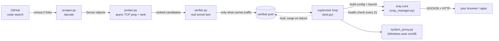
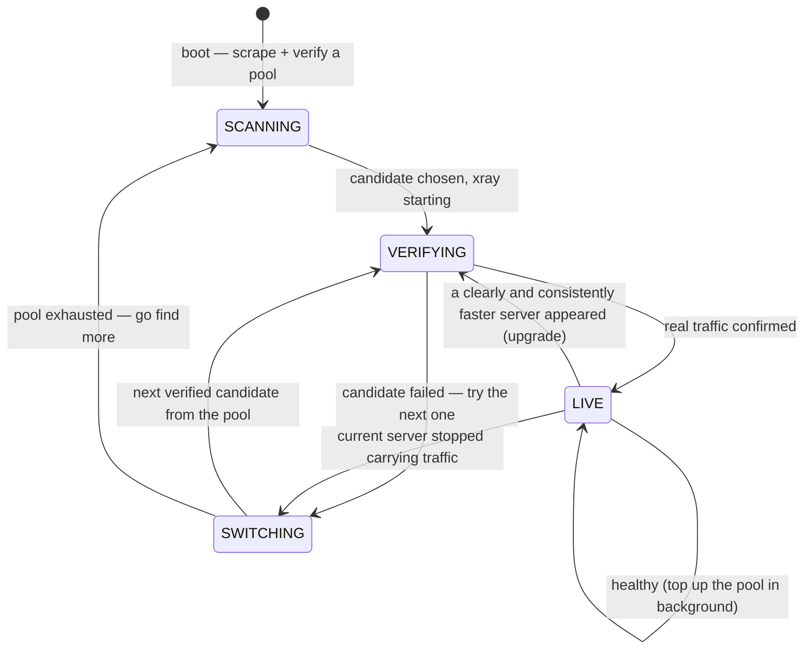

<p align="center">
  <a href="README.md"></a>
  <a href="README_fa.md"></a>
</p>

<p align="center">
  
</p>

<h1 align="center">WRAITH</h1>

<p align="center" dir="rtl">
  <b>یه فیلترشکنِ V2Ray که خودش خودشو سرِ پا نگه می‌داره.</b><br/>
  کانفیگ‌های عمومیِ vmess رو از گیت‌هاب جمع می‌کنه، خودش تست می‌کنه کدوما واقعاً کار می‌کنن (نه فقط کدوما پینگ می‌خورن)، و رو سریع‌ترینشون قفل می‌شه — خودکار، تا وقتی خودت ببندیش.
</p>

<p align="center">
  
  
  
  
</p>

<p align="center" dir="rtl">
  ساخته‌ی <a href="https://github.com/Amirzamani1l"><b>Amirzamani1l</b></a>
</p>

<div dir="rtl">

---

## فهرست

- [چرا ساختمش](#چرا-ساختمش)
- [یه نگاه کلی](#یه-نگاه-کلی)
- [چیکار میکنه](#چیکار-میکنه)
- [معماری](#معماری)
- [چرخه خودترمیمی](#چرخه-خودترمیمی)
- [داشبورد زنده](#داشبورد-زنده)
- [چطوری بگیریش](#چطوری-بگیریش)
- [پورتها](#پورتها)
- [تنظیمات](#تنظیمات)
- [ساختار پروژه](#ساختار-پروژه)
- [زیر کاپوت](#زیر-کاپوت)
- [حرف حساب](#حرف-حساب)
- [حمایت](#حمایت)
- [رفع اشکال](#رفع-اشکال)
- [ساخت فایل exe](#ساخت-فایل-exe)
- [مشارکت](#مشارکت)

---

## چرا ساختمش

عمداً رایگانه و اوپن‌سورس. وقتی اینترنت محدود می‌شه، یه عده سرورهای سالم رو چند برابرِ قیمت می‌فروشن به همون آدمایی که از همه بیشتر بهش نیاز دارن. من اینو ساختم که این کار بی‌معنی بشه — هرکی بخواد اجراش می‌کنه، کدشو می‌خونه، فورکش می‌کنه.

نه اکانت، نه اشتراک، نه واسطه. فقط یه برنامه که سرورِ سالم پیدا می‌کنه، خودش ثابت می‌کنه که کار می‌کنه، و تو رو به بهترینی که گیر آورده وصل نگه می‌داره.

---

## یه نگاه کلی

| | |
|---|---|
| **چیه** | یه برنامه‌ی ترمینالیه که یه تونلِ پروکسیِ سالم رو بدونِ ذره‌ای دردسر زنده نگه می‌داره |
| **چطوری سرور پیدا می‌کنه** | تو کدهای عمومیِ گیت‌هاب دنبالِ لینکِ `vmess://` می‌گرده و بازشون می‌کنه |
| **چطوری یکی رو انتخاب می‌کنه** | تستِ واقعیِ سرتاسرِ تونل، نه پینگِ خالی — مرتب‌شده بر اساسِ تأخیرِ واقعی |
| **وقتی یکی می‌میره** | همون لحظه می‌ره سراغِ سرورِ تأییدشده‌ی بعدی، و تو پس‌زمینه ذخیره‌ش رو پر می‌کنه |
| **رو ویندوز** | پروکسیِ سیستم رو خودش روشن/خاموش می‌کنه — بیشترِ برنامه‌ها (از جمله کروم) خودشون راه می‌افتن |
| **رو لینوکس/مک** | باید خودت برنامه‌تو دستی به پروکسیِ محلی وصل کنی، بقیه‌ش مو‌به‌مو همونه |
| **وابستگی‌ها** | `requests`، `python-dotenv`، `rich` — و خودِ Xray-core که برنامه خودش دانلودش می‌کنه |
| **ظاهر** | یه داشبوردِ ترمینالیِ زنده و متحرک که حتی رو `cmd.exe`ِ خامِ ویندوز هم درست درمیاد |

---

## چیکار میکنه

۱. **جمع می‌کنه** — تو کدهای عمومیِ گیت‌هاب دنبالِ `vmess://` می‌گرده و بازشون می‌کنه.
۲. **تأیید می‌کنه** — پینگِ TCP فقط می‌گه پورت بازه، نه اینکه چیزِ به‌دردبخوری پشتشه. برای هر کاندیدا یه تونلِ موقتِ جدا می‌سازه و یه درخواستِ واقعی ازش رد می‌کنه — فقط اونایی که واقعاً ترافیک جابه‌جا می‌کنن قبول می‌شن.
۳. **رتبه می‌ده** — بر اساسِ تأخیرِ واقعیِ رفت‌وبرگشت از پشتِ تونلِ تأییدشده، با یه امتیازِ اضافه واسه امنیتِ بهترِ انتقال (TLS/WS جلوی TCPِ خام).
۴. **وصل می‌شه** — Xray-core رو محلی به‌عنوانِ پروکسیِ SOCKS5 + HTTP بالا میاره، و (رو ویندوز) پروکسیِ سیستم رو خودش روشن می‌کنه که لازم نباشه دستی چیزی ست کنی.
۵. **خودشو ترمیم می‌کنه** — اگه سرورِ فعلی بمیره یا افت کنه، همون لحظه می‌ره سراغِ کاندیدای بعدی، و تو پس‌زمینه از گیت‌هاب سرورِ تازه می‌گیره که همیشه یه پشتیبونِ آماده داشته باشی.
۶. **نشون می‌ده** — یه داشبوردِ زنده: وضعیتِ اتصال، تاریخچه‌ی تأخیر، تعدادِ سرورهای تأییدشده، جدولِ سرورها، و فیدِ رویدادها.

نه رابطِ گرافیکی می‌خواد، نه وصل‌کردنِ دستی، نه بالاسری.

---

## معماری

هر مرحله یه ماژولِ جداست با یه کارِ مشخص. داده از چپ به راست جریان داره؛ حلقه‌ی supervisor کلِ چرخه رو می‌بنده و هر جا یه لینک بیفته ترمیمش می‌کنه.



**ایده‌ی اصلی:** بیشترِ ابزارها همین‌جا وایمیستن که «پورت به پینگ جواب داد». ولی WRAITH بهش اعتماد نمی‌کنه. پینگ فقط می‌گه پورت بازه؛ نمی‌گه یه تونلِ vmessِ زنده با UUIDِ معتبر پشتشه. برای همین هر کاندیدا واقعاً استفاده می‌شه قبل از اینکه بهش اعتماد بشه — یه Xrayِ موقت واسه هر سرور، یه درخواستِ واقعی ازش رد می‌شه، و فقط اونایی که واقعاً بایت جابه‌جا می‌کنن جونِ سالم به در می‌برن.

---

## چرخه خودترمیمی

Supervisor مالکِ هر تصمیمِ اتصال/سوییچه، که داشبورد بتونه با سرعتِ کامل انیمیشن بده. این‌ها دقیقاً همون حالت‌هاییه که بجِ بالای هدر ازشون رد می‌شه:



چندتا تصمیمِ عمدی این وسط هست:

- **دلش نمی‌خواد یه لینکِ سالم رو ول کنه.** یه افتِ لحظه‌ایِ تأخیر اتصالتو قطع نمی‌کنه. یه کاندیدا باید یه اندازه‌ی واقعی (`SWITCH_MARGIN_MS`) و چندبار پشتِ‌سرِهم (`SWITCH_CONFIRMATIONS`) سریع‌تر باشه، و سوییچ‌ها هم سقفِ زمانی دارن (`MIN_SWITCH_INTERVAL`) که هیچ‌وقت بینِ دوتا سرور هی این‌ور‌اون‌ور نپره.
- **سرورهای پینگ‌خورِ ولی مرده می‌رن رو نیمکت.** سروری که پینگ داده ولی تستِ واقعی رو رد کرده، یه مدت (`BENCH_SECONDS`) کنار گذاشته می‌شه که هی دوباره انتخاب نشه. اگه کلِ نیمکت پر شد، خالی می‌شه و همه یه شانسِ دوباره می‌گیرن.
- **ذخیره همیشه گرم می‌مونه.** وقتی راحت وصلی، تو پس‌زمینه بی‌سروصدا ذخیره‌ی پشتیبون رو پر می‌کنه، که قطعیِ بعدی همون لحظه ترمیم شه، نه اینکه از صفر بره اسکن کنه.

---

## داشبورد زنده

همه‌چی با `rich` رندر می‌شه، و مجموعه‌ی کاراکترها موقعِ بالا اومدن انتخاب می‌شه — کاراکترهای بلوکیِ کامل هر جا کنسول بکشه، و برگشتِ خودکار به ASCIIِ ساده هر جا نکشه (که حتی رو `cmd.exe`ِ خامِ ویندوز هم درست باشه، نه فقط ترمینال‌های مدرن).

| پنل | چی نشون می‌ده |
|---|---|
| **هدر / بنر** | لوگوی متحرکِ WRAITH، بجِ وضعیتِ زنده (LIVE / VERIFYING / SWITCHING / SCANNING / DOWN)، نودِ فعلی، مدتِ روشن‌بودن، و یه مترِ «چند درصدِ ترافیک داره رد می‌شه» |
| **TUNNEL** | نودِ فعال، چقدر پایدار بوده، وضعیتِ پروکسیِ سیستم، کیفیتِ اتصال، و آدرس‌های محلیِ SOCKS5 / HTTP |
| **LATENCY** | یه نمودارِ خطیِ ریز از زمان‌های رفت‌وبرگشتِ اخیر با now / avg / best / drop (شکاف تو خط یعنی چکِ ازدست‌رفته) |
| **POOL** | چندتا سرور جمع شده، چندتا تأیید شده، چندتا مرده، به‌علاوه پشتیبون‌های آماده‌ت |
| **LIVE SERVER GRID** | همه‌ی سرورهای جمع‌شده مرتب‌شده با پینگ، پروتکل، امتیازِ امنیتی، و ریپوی منبع — سرورِ فعلی، پشتیبون‌های تأییدشده، و مرده‌های نیمکت‌نشین همه رنگ‌بندی‌شدن |
| **LIVE FEED** | یه لاگِ رویداد با زمان: اتصال‌ها، سوییچ‌ها، مرگ‌ها، اسکن‌ها، هشدارها |

---

## چطوری بگیریش

### ویندوز، بدونِ نیاز به پایتون

آخرین `WRAITH.exe` رو از [صفحه‌ی Releases](../../releases) بگیر و اجراش کن. یه workflowِ گیت‌هاب اکشن، هر بار که نسخه‌ی جدید می‌دم، خودکار از رو سورس می‌سازتش — پس هیچ‌وقت با کدِ این‌جا ناهماهنگ نمی‌شه.

### اجرا از سورس (هر سیستمی)

<div dir="ltr">

```bash
pip install -r requirements.txt
cp .env.example .env        # Windows: copy .env.example .env
```

</div>

یه توکنِ گیت‌هاب بذار تو `.env` — هیچ دسترسی‌ای (scope) لازم نداره، فقط واسه اینه که سقفِ سرچت بره بالا (۵۰۰۰ تا در ساعت به‌جای ۶۰ تا). برو تو `github.com/settings/tokens`، یه `Generate new token (classic)` بزن، هیچ scope رو تیک نزن، و `Generate` کن.

فایلِ `.env` رو هیچ‌وقت کامیت نکن. از قبل تو `.gitignore` هست، ولی بازم قبلِ پوش‌کردن حواست باشه. اون `.env.example`ی که تو ریپوئه عمداً یه توکنِ الکی داره — محلی عوضش کن، نه تو فایلی که کامیت می‌شه.

<div dir="ltr">

```bash
python test.py
```

</div>

اولین اجرا خودش Xray-core رو دانلود می‌کنه (یه‌بار، چند مگابایت، تو پوشه‌ی دیتات کش می‌شه که بینِ اجراها بمونه و هی از نو دانلود نشه).

هر وقت خواستی با `Ctrl+C` بزن بیرون — تنظیماتِ پروکسیِ اصلیتو برمی‌گردونه و Xray رو تمیز می‌بنده.

---

## پورتها

وقتی راه افتاد، مرورگر یا برنامه‌تو به این‌ها وصل کن:

| پروتکل | آدرس |
|---|---|
| SOCKS5 | `127.0.0.1:10808` |
| HTTP | `127.0.0.1:10809` |

رو **ویندوز** خودکار انجام می‌شه — بیشترِ برنامه‌ها از جمله کروم بدونِ تنظیمِ دستی پروکسیِ سیستم رو می‌گیرن. رو **لینوکس/مک** باید خودت این‌ها رو تو تنظیماتِ شبکه‌ی برنامه یا سیستم بذاری.

---

## تنظیمات

مقادیرِ پیش‌فرضِ معقول تو `test.py` هست. به‌ندرت لازمه دست بزنی، ولی اگه خواستی واکنش رو با پایداری معامله کنی (یا برعکس)، این‌ها دسته‌هان:

| ثابت | پیش‌فرض | چی رو کنترل می‌کنه |
|---|---:|---|
| `HEALTH_INTERVAL` | `2.0` ثانیه | فاصله بینِ چک‌های واقعیِ اتصال رو تونلِ زنده |
| `MAX_CONSECUTIVE_FAILS` | `2` | چکِ ناموفقِ پشتِ‌سرِهم قبل از رهاکردنِ یه سرور |
| `VERIFY_TIMEOUT` | `3.5` ثانیه | مهلتِ هر درخواست واسه یه چکِ سلامت |
| `VERIFY_ATTEMPTS` | `2` | تلاش قبل از ردکردنِ یه کاندیدا موقعِ اتصال |
| `SETTLE_SECONDS` | `1.2` ثانیه | مهلت به Xray واسه bind و دست‌دادن بعد از استارت |
| `BENCH_SECONDS` | `300` ثانیه | چقدر یه سرورِ مرده‌ی اثبات‌شده رو نیمکت می‌مونه |
| `VERIFY_BATCH` | `8` | تعدادِ سرورهایی که **همزمان** تأیید می‌شن (هرکدوم تو Xrayِ جدا) |
| `POOL_SCAN_LIMIT` | `32` | چقدر عمیق تو لیستِ مرتب‌شده حاضره بره |
| `POOL_TARGET` | `4` | وقتی این‌قدر سرورِ تأییدشده پیدا شد، اسکن وایمیسته |
| `SWITCH_MARGIN_MS` | `120` میلی‌ثانیه | کاندیدا باید حداقل این‌قدر از سرورِ فعلی بهتر باشه… |
| `SWITCH_CONFIRMATIONS` | `5` | …این‌قدر بار پشتِ‌سرِهم، قبل از یه ارتقا |
| `MIN_SWITCH_INTERVAL` | `45` ثانیه | هیچ‌وقت بیشتر از این تناوب ارتقا نده (جلوی این‌ور‌اون‌ور‌پریدن) |

فریم‌ریت رو هم بدونِ دست‌زدن به کد، با یه متغیرِ محیطی می‌تونی محدود کنی:

<div dir="ltr">

```bash
WRAITH_FPS=12 python test.py     # lower CPU on a slow terminal
WRAITH_INTRO=0 python test.py    # skip the ghost intro at startup
```

</div>

---

## ساختار پروژه

| فایل | کارش |
|---|---|
| `test.py` | نقطه‌ی ورود، حلقه‌ی supervisor، چک‌های سلامت، سیم‌کشیِ داشبوردِ زنده |
| `ui.py` | رندرِ ترمینال (rich) — بنر، پنل‌ها، نمودارِ خطی، جدولِ سرورها |
| `ghost.py` | باز‌شدنِ سردِ استارتاپ: انیمیشنِ واقعیِ روح رو به‌شکلِ فیلمِ ASCII پخش می‌کنه |
| `ghost_frames.py` | فریم‌های انیمیشنِ روح (از رو گیفِ اصلی دیکود و فشرده شده) |
| `scraper.py` | سرچِ کدِ گیت‌هاب + بازکردنِ vmess |
| `prober.py` | موتورِ asyncِ پینگِ TCP، امتیازدهی/رتبه‌بندی |
| `verifier.py` | تأییدِ واقعیِ سرتاسرِ تونل (نه فقط پینگ) |
| `xray_manager.py` | دانلودِ باینری + چک‌سام، ساختِ کانفیگ، کنترلِ پروسه |
| `system_proxy.py` | روشن/خاموشِ خودکارِ پروکسیِ سیستمِ ویندوز |
| `banner.svg` | بنرِ README |
| `requirements.txt` | وابستگی‌های پایتون |
| `.env.example` | نمونه‌ی توکن — کپیش کن به `.env` |
| `.gitignore` | سکرت‌ها و کش‌ها و کانفیگِ runtime رو از گیت دور نگه می‌داره |
| `.github/workflows/` | همون CI که هر نسخه یه exeِ مستقلِ ویندوز می‌سازه |

یه توضیحِ فایل‌به‌فایل که هر ماژول مسئولِ چیه:

### `test.py` —  هسته

بنر و توالیِ استارتاپ رو بالا میاره، توکنتو می‌خونه، اسکرپ رو راه می‌ندازه، بعد دوتا تسکِ async رو تا ابد اجرا می‌کنه: **prober** (حلقه‌ی پینگِ پس‌زمینه) و **supervisor** (حلقه‌ی زنده‌نگه‌داری که مالکِ هر تصمیمِ اتصال/سوییچ/ارتقاست). حلقه‌ی رندرِ تطبیقیِ داشبورد هم این‌جاست — فریم‌ریتشو خودش بینِ `FPS_MIN` و `WRAITH_FPS` تنظیم می‌کنه بر اساسِ اینکه هر فریم چقدر طول می‌کشه کشیده بشه، که یه کنسولِ کند بشه «نرم ولی کندتر»، نه پاره‌پاره. منطقِ واقعیِ چکِ سلامت، نیمکت، و پرکردنِ ذخیره هم همین‌جاست.

### `ui.py` — داشبورد

رندرِ خالص، بدونِ منطق. بنرِ حروفِ بلوکیِ برجسته (با برگشتِ ASCII)، لوگوی موجِ‌رنگیِ متحرک، نوارِ پرشیِ sweep، مترِ سیگنالِ چهارتایی، نمودارِ خطیِ تأخیر، و هر پنج پنلِ زنده رو می‌کشه. مجموعه‌ی کاراکترشو موقعِ بالا اومدن انتخاب می‌کنه و اگه کنسول بلوکی رو نکشه می‌افته رو ASCII. همه‌چی از یه `state`ِ مشترک می‌خونه که supervisor توش می‌نویسه — UI فقط می‌خونتش، همینه که نمی‌ذاره دوتا حلقه سرِ ترمینال دعوا کنن.

### `scraper.py` — پیداکردنِ سرورها

چندتا کوئریِ سرچِ کدِ گیت‌هاب می‌زنه، محتوای فایل‌ها رو می‌گیره، `vmess://`ها رو با regex درمیاره، و هرکدومو به یه `Server` دیکود می‌کنه. درخواستاشو زیرِ سقفِ rate-limitِ گیت‌هاب نگه می‌داره که مکانیزمِ ضدِ‌سوءاستفاده رو نزنه، و تمیز فرق می‌ذاره بینِ یه توکنِ خراب/منقضی (`GitHubAuthError`) و یه rate-limitِ عادی (که فقط صبر می‌کنه). امتیازِ `safety_score`ِ هر سرور رو هم حساب می‌کنه — یه معیار که لایه‌های بیشترِ رمز/مبهم‌سازی رو جایزه می‌ده.

### `prober.py` — موتورِ پینگ

همزمان به هر سرور یه اتصالِ TCP باز می‌کنه و رفت‌وبرگشتو به میلی‌ثانیه ثبت می‌کنه (یا مرده علامتش می‌زنه). سرورهای در‌دسترس رو با یه امتیازِ ترکیبی مرتب می‌کنه: پینگِ کمتر بهتره، و هر واحدِ `safety_score` مثلِ ۳۰ میلی‌ثانیه تخفیف حساب می‌شه — پس یه سرورِ یه‌کم کندترِ ولی TLS/WS می‌تونه از یه TCPِ خامِ سریع‌تر جلو بزنه. `ranked_servers()` رو می‌ده دستِ supervisor که وقتی انتخابِ اول خراب دراومد بره سراغِ بعدی.

### `verifier.py` — اثباتِ اینکه سرورا واقعاً کار می‌کنن

تستِ صادقانه. واسه هر کاندیدا یه Xrayِ موقت رو یه جفت پورتِ محلیِ جدا بالا میاره، یه درخواستِ واقعی به‌صورتِ موازی ازش رد می‌کنه، و فقط اونایی که واقعاً ترافیک بردن رو برمی‌گردونه — مرتب‌شده بر اساسِ تأخیرِ *واقعیِ* سرتاسری، نه پینگِ خام. هر پروسه قبلِ برگشتن بسته می‌شه، پس هیچی تو پس‌زمینه نمی‌مونه. لیستِ URLهای تست هم قفلِ یه allow-listِ سفت‌وسخته: درخواست به هر چیزِ دیگه بلندبلند خطا می‌ده، نه اینکه بی‌صدا از پشتِ یه تونلِ ناشناس درز کنه.

### `xray_manager.py` — کنترلِ هسته

نسخه‌ی درستِ Xray-core رو واسه سیستم/معماریت مستقیم از Releaseهای رسمیِ XTLS دانلود می‌کنه **و چک‌سامِ SHA256 رو در برابرِ فایلِ `.dgst`ِ منتشرشده تأیید می‌کنه** قبلِ اینکه چیزی باز کنه — یه باینریِ دستکاری‌شده رد می‌شه، نه اجرا. کانفیگِ JSONِ Xray رو از یه `Server` می‌سازه (transportهای ws / grpc / h2 / tcp-http، به‌علاوه TLS با SNI و ALPN و اثرِ انگشتِ uTLS)، جلوی اشغال‌بودنِ پورتو می‌گیره، و چرخه‌ی حیاتِ پروسه‌ی Xray رو می‌چرخونه. stderrش تو یه لاگِ کوچیک واسه دیباگ می‌ره و موقعِ خروجِ تمیز پاک می‌شه (چون ممکنه IP و UUIDِ سرورا توش باشه — دلیلی نداره رو دیسک بمونه).

### `system_proxy.py` — تنظیمِ خودکارِ ویندوز

پروکسیِ سیستمِ ویندوزو با نوشتن تو رجیستریِ کاربرِ فعلی روشن/خاموش می‌کنه (`HKCU`، پس دسترسیِ ادمین نمی‌خواد). **اول تنظیماتِ اصلیتو ذخیره می‌کنه** و موقعِ خروج دقیقاً برشون می‌گردونه، و به WinINet می‌گه تنظیمات عوض شده که کروم/اج فوری بگیرنش. ترافیکِ localhost و LAN از تونل مستثنی می‌شه. رو لینوکس/مک این توابع بی‌ضررن و کاری نمی‌کنن — اونجا یه سوییچِ واحدِ جهانی واسه پروکسیِ سیستم نیست، پس اون کاربرا خودشون دستی وصل می‌کنن.

### `config_active.json` (ساخته می‌شه، کامیت نمی‌شه)

کانفیگِ زنده‌ی Xray واسه سروری که الان بهش وصلی. موقعِ اجرا خودِ `xray_manager.py` می‌نویستش و تو `.gitignore` هست — چون یه چیزِ ساخته‌شده‌ست و آدرس + UUIDِ یه سرورِ خاص رو داره، عمداً بیرونِ ریپو می‌مونه.

---

## زیر کاپوت

چندتا تصمیمِ طراحی که می‌ارزه بگم، چون فرقِ بینِ «گاهی وصل می‌شه» و «وصل می‌مونه» همیناست:

- **پینگ یعنی اتصال نیست.** خیلی از کانفیگای جمع‌شده به سرورِ وبِ معمولی اشاره می‌کنن یا UUIDِ منقضی دارن. پینگِ TCP رو فوری جواب می‌دن، امتیازِ خوب می‌گیرن، اول انتخاب می‌شن، و یه بایتم جابه‌جا نمی‌کنن. کلِ دلیلِ قابل‌اعتماد بودنِ این ابزار همون تأییده — `verifier.py` رو ببین.
- **تأییدِ موازی.** تست کردنِ کاندیداها یکی‌یکی دردناک کنده — یه سرورِ مرده چند ثانیه timeout می‌بره و ممکنه ده‌ها تا باشن. پس یه دسته‌ی کامل باهم تست می‌شن، هرکدوم تو Xrayِ جدا و پورتِ خودش.
- **رتبه‌بندیِ امنیت‌محور.** فقط تأخیر مهم نیست. امتیازدهی به transportهای TLS/WS/gRPC یه سرِ خط می‌ده جلوی TCPِ خام، پس یه سرورِ یه‌کم کندترِ ولی امن‌تر می‌تونه ببره. این یه معیارِ *اولویته*، نه تضمینِ امنیت (پایین‌تر می‌گم).
- **چکِ زنجیره‌ی تأمین رو هسته.** باینریِ Xray قبلِ اجرا در برابرِ SHA256ِ منتشرشده‌ی XTLS تأیید می‌شه. اگه یه روز مسیرِ دانلود دستکاری شه، همین جابه‌جایی رو می‌گیره، نه اینکه بی‌صدا اجراش کنه.
- **دفاع در عمق رو ترافیکِ تست.** تنها چیزی که تا حالا از پشتِ تونلِ ناشناس رد می‌شه، چکای ثابتِ اتصال به یه allow-listِ کوچیکه، که سرِ همون نقطه‌ی صداکردن اعمال می‌شه — پس یه تغییرِ کدِ آینده که اشتباهی چیزِ دیگه‌ای رو مسیر بده، بلندبلند خطا می‌ده، نه اینکه یه درخواست درز کنه.
- **جمع‌کردنِ تمیز.** موقعِ خروج تنظیماتِ پروکسیتو برمی‌گردونه، Xray رو می‌بنده، و لاگِ stderr رو که ممکنه IP/UUIDِ این جلسه رو داشته باشه پاک می‌کنه.

---

## حرف حساب

این سرورا **ناشناسن و از منابعِ عمومی جمع شدن.** هرکی می‌تونه یکی بالا بیاره و لینکشو منتشر کنه. امتیازِ امنیتیِ تو داشبورد یعنی *«TLS/WS داره»*، نه *«چک‌شده و امنه»* — اصلاً راهی نیست از بیرون سرورِ یه غریبه رو واقعاً تأیید کنی.

- واسه بانک، رمزِ ورود، یا هر چیزِ حساسی ازش استفاده **نکن**.
- اونی که سرورو می‌گردونه از نظرِ فنی می‌تونه ترافیکِ رمزنشده و مقصدایی که ازش رد می‌شن رو ببینه.
- نرم‌افزار فقط می‌تونه دورِ **فیلترینگ** بزنه. یه قطعیِ کاملِ بین‌المللیِ اینترنت یه داستانِ کاملاً دیگه‌ست و هیچی که رو دستگاهت اجرا شه حلش نمی‌کنه — تو اون حالت فقط اینترنتِ ماهواره‌ای مستقل از زیرساختِ محلی کار کرده.
- استفاده و انتشارِ ابزارِ دورزدنِ فیلترینگ تو بعضی کشورا **ریسکِ قانونی داره** — وزنِ اون ریسک با خودته. این فقط ابزاره.

---

## حمایت

WRAITH رایگانه، همیشه هم می‌مونه، و هیچیش پولی یا لَنگ نیست. اگه به دردت خورد و دوست داشتی کمک کنی سرِ پا بمونه، دونیت خوش‌اومده — کاملاً اختیاری، بدونِ هیچ امتیازِ خاصی، فقط یه راه واسه تشکر:

| | آدرس |
|---|---|
| **USDT (TRC-20)** | `TXW2qJqKcMFKVSYCQLXuZWZFPeoXaieeZQ` |
| **TRX** | `TXW2qJqKcMFKVSYCQLXuZWZFPeoXaieeZQ` |

واسه هردو همون یه آدرسه — چون هردو رو شبکه‌ی TRON‌ان. قبلِ فرستادنِ هرچی، حتماً با QR یا آدرسی که تو کیفِ‌پولِ خودت می‌بینی دوباره چک کن؛ هیچ‌وقت فقط چون تو یه README نوشته شده به یه آدرس اعتماد نکن.

---

## رفع اشکال

| علامت | دلیلِ احتمالی و راه‌حل |
|---|---|
| `GITHUB_TOKEN not found in .env` | فایلِ `.env` رو نساختی. `.env.example` رو کپی کن به `.env` و توکنتو بذار توش. |
| `GitHub rejected the token (401)` | توکن نامعتبر، منقضی، یا لغو شده. یکی جدید بساز (scope نمی‌خواد). |
| `GitHub returned 403 (not a rate limit)` | معمولاً مشکلِ مجوزِ توکنه — دوباره بسازش. |
| `No servers found` | اینترنت یا توکنتو چک کن؛ گاهی سرچ فقط هیچی برنمی‌گردونه — دوباره اجرا کن. |
| `port 10808/10809 already in use` | یه نمونه‌ی دیگه از WRAITH / v2rayN / Xray در حال اجراست. اول اونو ببند. |
| رو ویندوز برنامه‌ها مسیر نمی‌شن | مطمئن شو هدر `sys proxy: ON` رو نشون می‌ده. برنامه‌هایی که پروکسیِ سیستم رو نادیده می‌گیرن باید پورتا رو دستی بگیرن. |
| همه‌چی مرده/نیمکتی نشون می‌ده | دسته‌ی جمع‌شده اتفاقاً همه خراب دراومده — تو پس‌زمینه از گیت‌هاب دوباره پر می‌شه؛ یه لحظه صبر کن یا دوباره اجرا کن. |
| بنر شبیهِ جعبه‌های خالیه | کنسولت گلیفِ بلوکی رو نمی‌کشه — باید خودکار بیفته رو ASCII؛ واسه ظاهرِ کامل Windows Terminal رو امتحان کن. |
| می‌خوای ببینی Xray از چی نالیده | تا وقتی در حالِ اجراست، `xray_stderr.log` رو تو پوشه‌ی دیتای WRAITH چک کن (موقعِ خروجِ تمیز پاک می‌شه). |

---

## ساخت فایل exe

لازم نیست — هر نسخه خودکار ساخته می‌شه — ولی اگه خواستی محلی بسازی، با [PyInstaller](https://pyinstaller.org/) یه خطه:

<div dir="ltr">

```bash
pip install -r requirements.txt pyinstaller
pyinstaller --onefile --name WRAITH --console --collect-all rich test.py
```

</div>

نتیجه می‌ره تو `dist/WRAITH.exe`. اون CIای که این کارو هر نسخه‌ی گیت‌هاب انجام می‌ده تو `.github/workflows/build.yml` هست — رو یه ویندوزِ واقعی اجرا می‌شه، پس هیچ‌کس واسه *استفاده* از نتیجه پایتون نمی‌خواد، فقط واسه ساختنش، و اونم کاملاً خودکاره.

---

## مشارکت

Fork و issue و pull request همه خوش‌اومدن — کلِ هدفِ اوپن‌سورس بودنش همینه. چندتا مسیر که واقعاً کمک می‌کنه:

- منابعِ بیشتر واسه جمع‌کردن، فراتر از سرچِ کدِ گیت‌هاب
- پشتیبانی از پروتکل‌های بیشتر (vless، trojan، shadowsocks)
- رتبه‌بندیِ باهوش‌تر (jitter و پایداری به‌جای فقط تأخیرِ خام)
- یه سوییچِ بومیِ پروکسیِ سیستم واسه لینوکس/مک

اگه یه چیزِ به‌دردبخور روش ساختی، رایگان نگهش دار.

</div>
