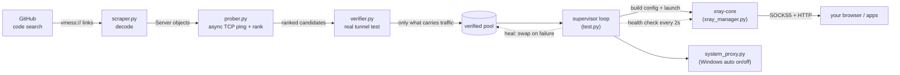
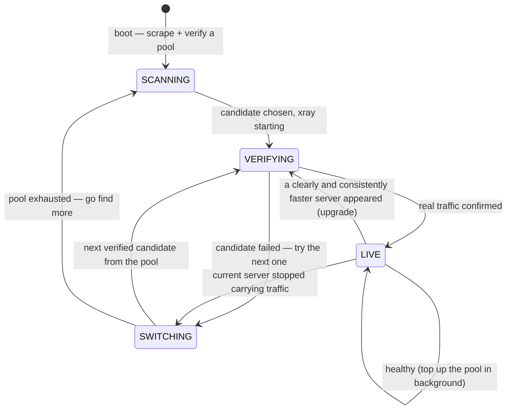

<p align="center">
  
</p>

<h1 align="center">WRAITH</h1>

<p align="center">
  <b>A self-healing V2Ray connection manager.</b><br/>
  It scrapes public vmess configs off GitHub, verifies which ones actually
  carry traffic (not just which ones ping), and locks onto the fastest one —
  automatically, forever, until you close it.
</p>

<p align="center">
  
  
  
  
  
</p>

<p align="center">
  made by <a href="https://github.com/Amirzamani1l"><b>Amirzamani1l</b></a>
</p>

---

## Table of contents

- [Why this exists](#why-this-exists)
- [At a glance](#at-a-glance)
- [What it actually does](#what-it-actually-does)
- [Architecture](#architecture)
- [The self-healing loop](#the-self-healing-loop)
- [The live dashboard](#the-live-dashboard)
- [Get it](#get-it)
- [Ports](#ports)
- [Configuration and tuning](#configuration-and-tuning)
- [Project layout](#project-layout)
- [Under the hood](#under-the-hood)
- [The honest part (read this)](#the-honest-part-read-this)
- [Troubleshooting](#troubleshooting)
- [Building the Windows .exe yourself](#building-the-windows-exe-yourself)
- [Contributing](#contributing)
- [License](#license)

---

## Why this exists

Free and open, on purpose. When internet access gets restricted, some people
turn around and sell working proxy servers at inflated prices to those who
need them most. This project's whole point is to make that unnecessary —
anyone can run it, anyone can read the code, anyone can fork it.

No accounts. No subscriptions. No middleman. Just a program that finds working
servers, proves they work, and keeps you connected to the best one it can find.

---

## At a glance

| | |
|---|---|
| **What it is** | A terminal app that keeps a working proxy tunnel alive with zero babysitting |
| **How it finds servers** | Searches public GitHub code for `vmess://` links and decodes them |
| **How it picks one** | Real end-to-end tunnel test — not a TCP ping — ranked by true latency |
| **When one dies** | Swaps to the next verified server instantly, refills the pool in the background |
| **On Windows** | Flips the system proxy on/off automatically — most apps (incl. Chrome) just work |
| **On Linux/macOS** | Point your app at the local proxy manually; everything else is identical |
| **Dependencies** | `requests`, `python-dotenv`, `rich` — plus Xray-core, which it downloads for you |
| **UI** | A live, animated terminal dashboard that renders even in stock Windows `cmd.exe` |

---

## What it actually does

1. **Scrapes** — searches public GitHub code for `vmess://` links and decodes them.
2. **Verifies** — a TCP ping only proves a port is open, not that anything useful
   is behind it. Every candidate gets its own throwaway tunnel and a real request
   pushed through it — only servers that genuinely carry traffic make the cut.
3. **Ranks** — by real round-trip latency through the verified tunnel, with a
   bonus for stronger transport security (TLS/WS over plain TCP).
4. **Connects** — spins up Xray-core locally as a SOCKS5 + HTTP proxy, and (on
   Windows) flips the system proxy on automatically so apps don't need manual setup.
5. **Heals** — if the active server dies or degrades, it swaps to the next verified
   candidate instantly, pulling fresh ones from GitHub in the background so there's
   always a backup pool ready.
6. **Displays** — a live terminal dashboard: connection status, latency history,
   verified pool size, server grid, event feed.

No GUI needed. No manual reconnects. No babysitting.

---

## Architecture

Each stage is a separate module with a single job. Data flows left to right;
the supervisor loop closes the loop and heals it when a link goes down.



**The key idea:** most tools stop at "the port answered a ping." WRAITH doesn't
trust that. A ping proves a port is open; it does **not** prove a live vmess
tunnel with a valid UUID sits behind it. So every candidate is actually *used*
before it's trusted — a throwaway Xray instance per server, a real HTTP request
pushed through each, and only the ones that move real bytes survive.

---

## The self-healing loop

The supervisor owns every connect/switch decision so the dashboard can animate
at full speed. These are the exact states the header badge cycles through:



A few deliberate design choices live in here:

- **It's reluctant to leave a working link.** A one-off latency dip won't drop
  your connection. A candidate has to be faster by a real margin (`SWITCH_MARGIN_MS`)
  for several checks in a row (`SWITCH_CONFIRMATIONS`), and upgrades are rate-limited
  (`MIN_SWITCH_INTERVAL`) so it never flaps between two servers.
- **Dead-but-pinging servers get benched.** A server that answered a ping but
  failed a real tunnel test is sidelined for a while (`BENCH_SECONDS`) instead of
  being picked again and again. If the whole bench fills up, it's cleared and
  everything gets a second chance.
- **The pool is kept warm.** While you're happily connected, it quietly refills
  the backup pool in the background, so the *next* failure heals instantly instead
  of triggering a cold scan.

---

## The live dashboard

Everything renders with [`rich`](https://github.com/Textualize/rich), and the
glyph set is chosen at import time — full block-drawing characters where the
console supports them, automatic fall-back to plain ASCII where it doesn't (so it
looks right even in a stock Windows `cmd.exe`, not just modern terminals).

| Panel | What it shows |
|---|---|
| **Header / banner** | Animated WRAITH logo, live status badge (LIVE / VERIFYING / SWITCHING / SCANNING / DOWN), current node, uptime, and a "% of traffic getting through" meter |
| **TUNNEL** | Active node, how long it's been stable, system-proxy state, connection quality, and the local SOCKS5 / HTTP addresses |
| **LATENCY** | A sparkline of recent round-trip times with now / avg / best / drop counts (gaps in the line are dropped checks) |
| **POOL** | How many servers were scraped, how many are verified, how many are dead, plus your standby backups |
| **LIVE SERVER GRID** | Every scraped server ranked by ping, with protocol, security score, and source repo — current server, verified backups, and benched duds all colour-coded |
| **LIVE FEED** | A timestamped event log: connects, swaps, deaths, scans, warnings |

---

## Get it

### Windows, no Python required

Grab the latest `WRAITH.exe` from the [Releases page](../../releases) and run it.
A GitHub Actions workflow builds it automatically from source on every release,
so it's never out of sync with the code here.

### Run from source (any OS)

```bash
pip install -r requirements.txt
cp .env.example .env        # Windows: copy .env.example .env
```

Drop a GitHub token into `.env` — **no scopes needed**, it's only for the higher
search rate limit (5,000/hr vs 60/hr unauthenticated):

> `github.com/settings/tokens` → **Generate new token (classic)** → leave every
> scope unchecked → **Generate**

> ⚠️ **Never commit `.env`.** It's already git-ignored, but double-check before
> you push anything public. The `.env.example` in this repo ships with a
> placeholder token on purpose — replace it locally, not in the committed file.

```bash
python test.py
```

First run downloads Xray-core automatically (one-time, a few MB, cached in your
user-data folder so it survives between runs and doesn't re-download every launch).

Exit anytime with `Ctrl+C` — it restores your original proxy settings and shuts
Xray-core down cleanly.

---

## Ports

Once it's running, point your browser or app at:

| Protocol | Address |
|---|---|
| SOCKS5 | `127.0.0.1:10808` |
| HTTP | `127.0.0.1:10809` |

On **Windows** this happens automatically — most apps, including Chrome, pick up
the system proxy without any manual setup. On **Linux / macOS**, set these in your
app or OS network settings yourself.

---

## Configuration and tuning

Sensible defaults ship in [`test.py`](test.py). You rarely need to touch them, but
if you want to trade responsiveness for stability (or vice-versa), these are the
dials:

| Constant | Default | What it controls |
|---|---:|---|
| `HEALTH_INTERVAL` | `2.0` s | Gap between real connectivity checks on the live tunnel |
| `MAX_CONSECUTIVE_FAILS` | `2` | Failed checks in a row before a server is abandoned |
| `VERIFY_TIMEOUT` | `3.5` s | Per-request timeout for a health check |
| `VERIFY_ATTEMPTS` | `2` | Tries before a candidate is written off during connect |
| `SETTLE_SECONDS` | `1.2` s | Grace period for Xray to bind + handshake after start |
| `BENCH_SECONDS` | `300` s | How long a proven-dead server stays benched |
| `VERIFY_BATCH` | `8` | Servers verified **simultaneously** (each in its own Xray) |
| `POOL_SCAN_LIMIT` | `32` | How deep down the ranked list a scan is willing to go |
| `POOL_TARGET` | `4` | Stop scanning once this many verified servers are found |
| `SWITCH_MARGIN_MS` | `120` ms | A candidate must beat the current server by at least this… |
| `SWITCH_CONFIRMATIONS` | `5` | …for this many checks in a row before an upgrade |
| `MIN_SWITCH_INTERVAL` | `45` s | Never upgrade more often than this (kills flapping) |

Frame rate can be capped without editing anything via an environment variable:

```bash
WRAITH_FPS=12 python test.py     # lower CPU on a slow terminal
WRAITH_INTRO=0 python test.py    # skip the ghost cold-open at startup
```

---

## Project layout

```
test.py                  entry point, supervisor loop, health checks, live dashboard wiring
ui.py                    terminal rendering (rich) — banner, panels, sparklines, server grid
ghost.py                 startup cold-open: plays the real ghost animation as an ASCII film
ghost_frames.py          the ghost animation frames (decoded from the source GIF, compressed)
scraper.py               GitHub code search + vmess decoding
prober.py                async TCP ping engine, scoring/ranking
verifier.py              real end-to-end tunnel verification (not just ping)
xray_manager.py          binary download + checksum, config generation, process control
system_proxy.py          Windows system proxy auto on/off
banner.svg               the README banner
requirements.txt         Python dependencies
.env.example             token template — copy to .env (git-ignored)
.gitignore               keeps secrets, caches and the runtime config out of git
.github/workflows/       CI that builds the standalone Windows .exe on every release
LICENSE                  MIT
```

A file-by-file breakdown of what each module is responsible for:

### `test.py` — the supervisor

The brain. Boots the banner + startup sequence, loads your token, kicks off the
scrape, then runs two async tasks forever: the **prober** (background ping loop)
and the **supervisor** (the keep-alive loop that owns every connect/swap/upgrade
decision). It also runs the adaptive dashboard render loop — pacing its own frame
rate between `FPS_MIN` and `WRAITH_FPS` based on how long each frame actually takes
to paint, so a slow console degrades to "smooth but slower" instead of tearing.
Contains the real health-check logic, the bench, and the pool builder.

### `ui.py` — the dashboard

Pure rendering, no logic. Draws the extruded block-letter banner (with an ASCII
fallback), animated colour-wave logo, bouncing "sweep" bar, four-bar signal meter,
latency sparkline, and all five live panels. Picks its glyph set at import time
and drops to plain ASCII if the console can't encode block characters. Everything
here reads from a single shared `state` dict that the supervisor writes — the UI
only ever reads it, which is what keeps the two loops from fighting over the terminal.

### `scraper.py` — finding servers

Runs several GitHub code-search queries, pulls file contents, regex-matches
`vmess://` links, and base64-decodes each into a typed `Server` dataclass. Paces
its own requests below GitHub's search rate limit so it never trips the
abuse-detection mechanism, and cleanly distinguishes a bad/expired token
(`GitHubAuthError`) from ordinary rate-limiting (which it just waits out). Also
computes each server's `safety_score` — a heuristic that rewards more
encryption/obfuscation layers.

### `prober.py` — the ping engine

Concurrently opens a TCP connection to every server and records the round-trip in
milliseconds (or marks it dead). Ranks reachable servers best-first using a
combined score: lower ping is better, and every `safety_score` point is treated
as a 30 ms discount — so a slightly slower but TLS/WS server can outrank a faster
plain-TCP one. Exposes `ranked_servers()` so the supervisor can fall through to
the next candidate when the top pick turns out to be a dud.

### `verifier.py` — proving servers actually work

The honest test. Spins up a throwaway Xray for each candidate on its own pair of
local ports, pushes a real request through each in parallel, and returns only the
servers that genuinely carried traffic — ranked by *real* end-to-end latency, not
raw ping. Every process is torn down before it returns, so nothing is left running.
The set of test URLs is locked to a hard allow-list: a request to anything else
raises loudly rather than silently leaking through an anonymous tunnel.

### `xray_manager.py` — the core wrangler

Downloads the right Xray-core build for your OS/architecture straight from XTLS's
official GitHub releases **and verifies the SHA256 checksum** against the published
`.dgst` file before extracting anything — a swapped binary gets refused, not run.
Builds the Xray JSON config from a `Server` (handling ws / grpc / h2 / tcp-http
transports, plus TLS with SNI, ALPN and uTLS fingerprint), guards against a port
already being in use, and manages the Xray process lifecycle. Its stderr is written
to a small log for debugging and wiped on a clean exit (it can contain server IPs
and UUIDs — no reason for that to sit on disk once you've closed the app).

### `system_proxy.py` — Windows auto-configuration

Flips the Windows system proxy on/off by writing to the current user's registry
(`HKCU`, so no admin rights). It **saves your original settings first** and restores
them exactly on exit, and tells WinINet the settings changed so Chrome/Edge pick
them up immediately. Localhost + LAN traffic is excluded from the tunnel. On
Linux/macOS these functions are harmless no-ops — there's no single universal
system-proxy switch there, so those users point their app at the local proxy manually.

### `config_active.json` (generated, not committed)

The live Xray config for the currently-connected server. It's written at runtime by
`xray_manager.py` and is **git-ignored** — it's a generated artifact and embeds a
specific server's address + UUID, so it's intentionally kept out of the repo.

---

## Under the hood

A few design decisions worth calling out, because they're the difference between
"connects sometimes" and "stays connected":

- **A ping is not a connection.** Plenty of scraped configs point at ordinary web
  servers or carry expired UUIDs. They answer a TCP ping instantly, score great, get
  picked first, and never move a single byte. Verification is the whole reason this
  tool is reliable — see [`verifier.py`](verifier.py).
- **Parallel verification.** Testing candidates one at a time is painfully slow — a
  single dead server costs several seconds of timeouts, and there can be dozens. So a
  whole batch is tested at once, each in its own isolated Xray on its own ports.
- **Security-aware ranking.** Latency isn't the only thing that matters. The scoring
  gives TLS/WS/gRPC transports a head start over plain TCP, so a marginally slower but
  better-obfuscated server can win. It's a *priority* heuristic, not a safety guarantee
  (see below).
- **Supply-chain check on the core.** The Xray binary is verified against XTLS's
  published SHA256 before it's ever executed. If the download path is ever tampered
  with, this catches the swap instead of silently running it.
- **Defense in depth on test traffic.** The only things ever sent through an
  anonymous tunnel are fixed connectivity checks to a small allow-list of hosts,
  enforced at the call site — so a future code change that accidentally routes
  something else fails loudly rather than leaking a request.
- **Clean teardown.** On exit it restores your original proxy settings, stops
  Xray-core, and deletes the stderr log that could contain the IPs/UUIDs it tried
  this session.

---

## The honest part (read this)

These are **anonymous, crowd-sourced servers.** Anyone can spin one up and publish
the link. The security rating in the dashboard means *"uses TLS/WS,"* **not**
*"verified safe"* — there's no way to actually verify a stranger's server from the
outside.

- **Don't** use this for banking, login credentials, or anything sensitive.
- The person running the server can technically see unencrypted traffic and the
  destination hosts passing through it.
- Software can only route around **filtering**. A full international connectivity
  shutdown is a different problem entirely, and nothing running on your machine can
  fix that — satellite internet is the only thing that's worked independently of
  local infrastructure in that scenario.
- Using and publishing circumvention tools carries **legal risk in some countries** —
  that risk is yours to weigh. This is just the tool.

---

## Troubleshooting

| Symptom | Likely cause & fix |
|---|---|
| `GITHUB_TOKEN not found in .env` | You didn't create `.env`. Copy `.env.example` to `.env` and paste your token. |
| `GitHub rejected the token (401)` | Token is invalid, expired, or revoked. Generate a fresh one (no scopes needed). |
| `GitHub returned 403 (not a rate limit)` | Usually a token permissions problem — regenerate it. |
| `No servers found` | Check your internet connection or token; occasionally the search just returns nothing — rerun. |
| `port 10808/10809 already in use` | Another WRAITH / v2rayN / Xray instance is running. Close it first. |
| Apps not routing on Windows | Confirm the header shows `sys proxy: ON`. Apps that ignore the system proxy need the ports set manually. |
| Everything shows as dead / benched | The scraped batch happened to be all duds — it refills from GitHub in the background; give it a moment or rerun. |
| Banner looks like empty boxes | Your console can't encode block glyphs — it should auto-fall-back to ASCII; try Windows Terminal for the full look. |
| Need to see what Xray complained about | Check `xray_stderr.log` in your per-user WRAITH data folder while it's running (it's deleted on clean exit). |

---

## Building the Windows .exe yourself

You don't need to — every release is built automatically — but if you want a local
build, it's a one-liner with [PyInstaller](https://pyinstaller.org/):

```bash
pip install -r requirements.txt pyinstaller
pyinstaller --onefile --name WRAITH --console --collect-all rich test.py
```

The result lands in `dist/WRAITH.exe`. The CI that does this on every GitHub Release
lives in [`.github/workflows/build.yml`](.github/workflows/build.yml) — it runs on a
real Windows runner, so no one needs Python installed to *use* the result, only to
build it, and even that step is fully automated.

---

## Contributing

Forks, issues and pull requests are all welcome — that's the entire point of the
project being open. Some directions that would genuinely help:

- More scrape sources beyond GitHub code search
- Support for additional protocols (vless, trojan, shadowsocks)
- Smarter ranking (jitter and stability over raw latency)
- A native system-proxy toggle for Linux/macOS

If you build something useful on top of it, keep it free.

---

## License

MIT — see [LICENSE](LICENSE). Use it, fork it, sell nothing.
